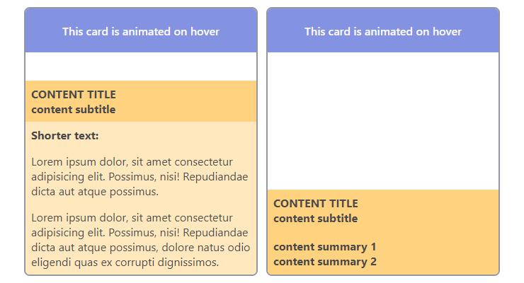

# Animated Cards for Variable-Length Content

These cards serve as proof-of-concept for my KSC Space Launches project UI.

I needed a Card component that would display only the basic information/summary by
default so that it only minimally obscure the card background image, if any. On hover, the information block (.card\_\_content) would slide up revealing additional info.

The main difficulty arises from the fact that we don't know the amount of that
additional info text as it will be loaded dynamically. On hover, my goal is to display as much info as possible while not covering the card header. If all of the additional info fits in the card, the info block goes up to the point where its bottom edge aligns with the bottom of the card. Otherwise, if the additional text overflows, the info block goes up all the way to the card header. The overflowing text is hidden, which is okay for my purposes.

## The Design Approach

1. The .card\_\_content elemnent is defined to always be the same set height equal to the card height minus the card header height.

2. Initially, the .card\_\_content element is shifted up enought to show only the content header that has a fixed height.

3. On hover, we slide the .card\_\_content element up all the way to the card header, so it occupies all space below card header down to the bottom card edge.

4. By justifying the content to flex-end on hover, we shift it down in case the additional info does not occupy all available card space.

IMPORTANT: flex-grow for the .card\_\_content_detail is set to be 0, otherwise it shrinks the content header height in cases when the content detail text overflows the card.
